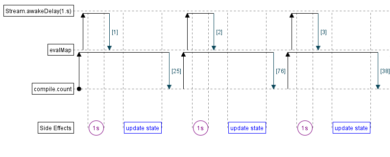

# Sabrina Collatz Conjecture mini project
## Tech Stack
scala fs2 http4s and cats.
## Introduction
Small mini project that on request will start a new cats fiber (lightweight thread) which will infinitely stream a series in the collatz conjecture from a given start.
We call this a machine, it will store an internal number as its current number via atomic ref.
If the current number reaches 1 then it will restart from the given start.

What is the Collatz Conjecture? It is given by the formula below

$$
C(n) =
\begin{cases}
\frac{n}{2} & \text{if $n$ is even} \\
3n + 1 & \text{if $n$ is odd}
\end{cases}
$$

## List of Routes
### POSTS
| Method | Endpoint                       | Description                                           |
|--------|--------------------------------|-------------------------------------------------------|
| POST   | `/create/<id>/<startingNumber>` | Creates a machine with the specified `id` and `startingNumber`. |
| POST   | `/destroy/<id>`                 | Destroys the machine with the given `id` by cancelling its fiber. |
| POST   | `/increment/<id>/<amount>`      | Increments the value of the machine with the given `id` by the specified `amount`. |

### GET
| Method | Endpoint         | Description                                                                                               |
|--------|------------------|-----------------------------------------------------------------------------------------------------------|
| GET    | `/messages/<id>` | Retrieves the messages of a machine with the specified `id` and `startingNumber`.                         |
| GET    | `/messages`      | Retrieves all messages from all machines at the instance of the request as an infinitely updating stream. |

Below is an image of how the create machine stream works, created using aquascape by Zainab Ali

## Sources used to help
- ChatGPT
- Typelevel Discord
- Rock the JVM
- *Functional Stream Processing in Scala* by Zainab Ali (Early Access)
- *Functional Programming Strategies in Scala With Cats* by Noel Welsh and Dave Gurnell
- Basic internet search

## Assumptions
- When asked to create a machine, I assumed a fiber was sufficient
- The integer type is enough, super large numbers are not necessary, bigger numbers can be calculated if needed in the future.
- F[_] not needed IO is fine 
- logger doesn't fully utilize FP and isn't pure, is fine

## RoadMap - TODO
- Proper testing of routes and service layer
- Instead of `GetAll` returning all machines at that current time, automatically update if a new machine is created
- More logging of failures and completed journeys
- Throw errors correctly when chaining IO calculations, currently not doing this
- Correctly apply the Topic functionality in FS2 to create an easier manageable all messages system
- Modify the headers on the return events so they are more aligned with SSE
- Use the config to have a limit of created machines and a max calculation limit

